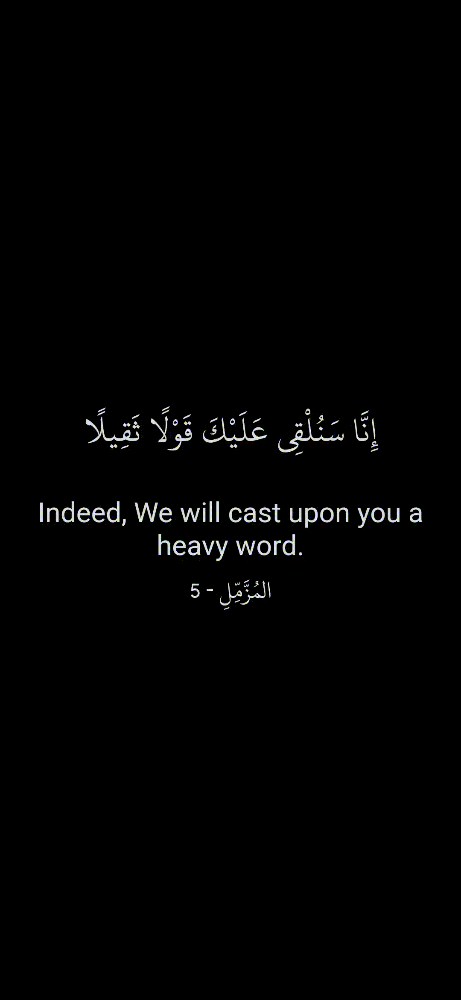
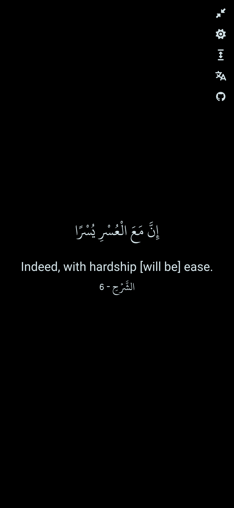
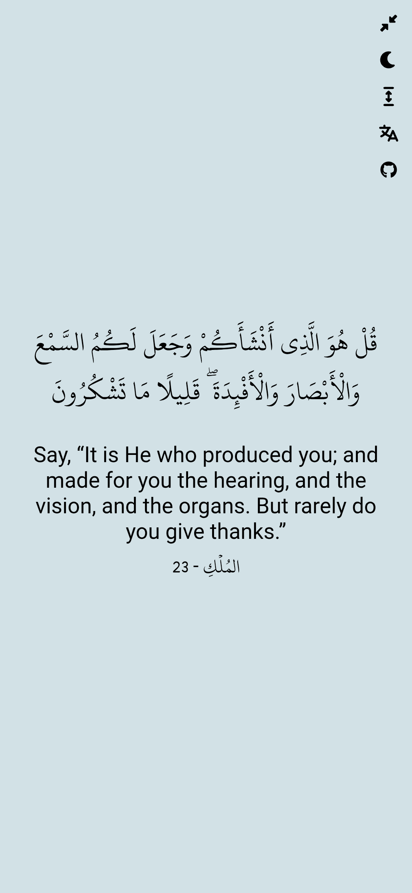
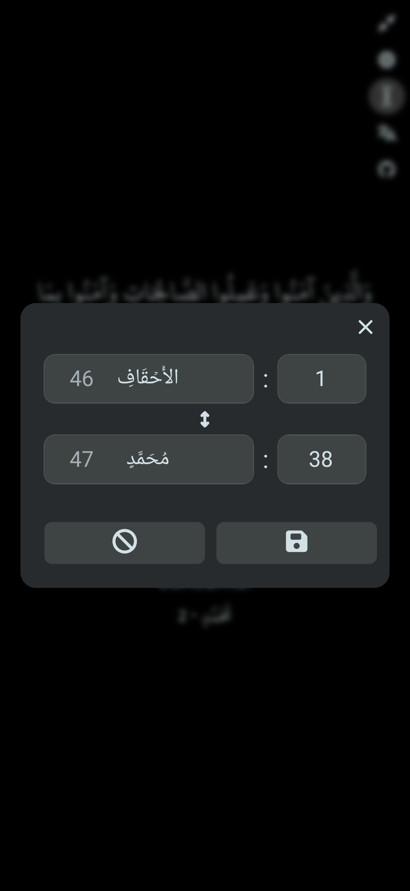
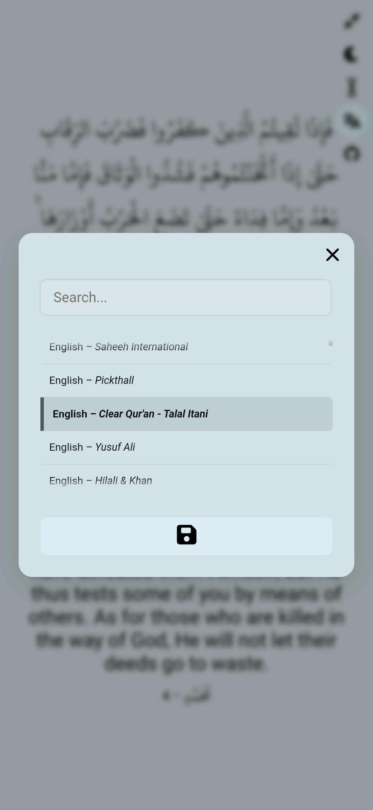

# 📖 Random Quran Verse: A Reel-Style Explorer

A web application for exploring the Holy Quran, featuring a reel style interface with smooth animations and intuitive navigation.  
Here is a [Live Demo.](https://random-quran-verse-wheat.vercel.app/)


---
### Screenshots

|                                   |                                   |                            |                                   |                                   |
| :-------------------------------: | :-------------------------------: | :------------------------: | --------------------------------- | --------------------------------- |
|  |  |  |  |  |

---

### Disclaimer!

-   This application is designed for exploration and inspiration only. It is not for making decisions, seeking omens, fortune-telling or any form of divination.
-   Reel-style presentation may show verses out of context, so this app should not replace traditional, sequential Qur’an reading. For proper understanding, always refer to full passages and authentic sources, using established methods of reading and study.

---

### Core Experience

-   **Random Verse Generation**: Scroll vertically to generate random Quran verses
-   **Swipe Navigation**: Swipe horizontally (or use arrow keys) to navigate between previous and next verses
-   **Range Selection**: Specify a custom range of Chapters and Verses to explore or to strengthen your memorization
-   **Multi-Language Support**: Choose from various translation languages
-   **Smooth Animations**: Beautiful transitions and animations for a seamless experience
-   **Quick Jump**: On mobile, if you have the [Tarteel](https://www.tarteel.ai/) app installed, clicking the Surah name and verse number will take you directly to that verse in the app. This feature is provided solely for convenience and is not sponsored or endorsed by Tarteel.

### User Experience & Control

-   **Theme Control:** Toggle between **Dark and Light themes**, with your preference saved persistently.
-   **Immersive Fullscreen:** Enter a focused, fullscreen reading mode.
-   **Optimized Input:** Full support for **touch gestures** on mobile and **keyboard controls** on desktop.
-   **Responsive Layout:** Designed to work perfectly across all devices (desktop, tablet, mobile).
-   **Action Buttons:** Double-tap to show or hide the control panel.

---

### Usage Guide

| Action                 | Control (Desktop)                                   | Control (Mobile)                    |
| :--------------------- | :-------------------------------------------------- | :---------------------------------- |
| **New Verse**          | Click & Drag / Vertical Scroll / Space / Arrow Down | Vertical Swipe                      |
| **Previous/Next**      | Click & Drag / Arrow Right & Left                   | Horizontal Swipe                    |
| **Show/Hide Controls** | Double Click Outside The Content Area               | Double Tap Outside The Content Area |

**Quick note:**  
The app may feel slow or laggy the very first time you open it 😬 This is because it fetches the entire Quran from the API up front. It may take a little longer than you expected, please be patient and wait until the loading icon disappears, once everything is loaded, your experience will be smooth!

---

## Tech Stack

The project is part of my learning journey and is built entirely with pure vanilla JavaScript to showcase fundamental web development skills, without relying on external frameworks or complex dependencies.

-   **Vanilla JavaScript (ES6+):** Modern JavaScript with modules, `async/await`, `fetch` and more.
-   **External API:** Al Quran Cloud (for content).
-   **Vite:** Used solely as a fast development server and build tool.
-   **IndexedDB:** Client-side database for content caching.
-   **Web APIs**: Web Workers, Touch/mouse Events, Keyboard Events, localStorage and more.

---

## Getting Started

### Prerequisites

-   Node.js (v14 or higher)
-   npm or yarn

### Installation & Development

1.  **Clone:**
    ```bash
    git clone https://github.com/yourusername/Random-Quran-Verse.git
    cd Random-Quran-Verse
    ```
2.  **Install:**
    ```bash
    npm install
    ```
3.  **Run Dev Server:**
    ```bash
    npm run dev
    ```
    Open `http://localhost:5173` in your browser.

### Production Build

```bash
npm run build
```

The deployable files will be generated in the `dist` directory.

## Project Structure

```
Random-Quran-Verse/
├── src/
│   ├── components/      # UI components (modals, panels, etc.)
│   ├── events/          # Event handlers (controls, actions)
│   ├── utils/           # Utility functions (DB, loading, etc.)
│   ├── assets/          # Fonts and static assets
│   ├── main.js          # Application entry point
│   ├── dom.js           # DOM element references
│   └── style.css        # Main stylesheet
├── public/              # Public assets
├── index.html           # Main HTML file
├── vite.config.js       # Vite configuration
└── package.json         # Project dependencies
```

---

## Contributions

All contributions are welcome—this project is an open learning experience. Help improve it by addressing:

-   Bug fixes
-   New features
-   Performance optimizations
-   UI/UX enhancements

### How to Contribute

1. Fork the repository
2. Create your feature branch (`git checkout -b feature/AmazingFeature`)
3. Commit your changes (`git commit -m 'Add some AmazingFeature'`)
4. Push to the branch (`git push origin feature/AmazingFeature`)
5. Open a Pull Request

Please ensure your pull request adheres to the existing coding style.

---

### License

This project is licensed under the MIT License - see the [LICENSE](LICENSE) file for details.

### Acknowledgments

-   Quran text and translations are sourced from [Al Quran Cloud](https://alquran.cloud/) API
-   [Font Awesome](https://fontawesome.com/) icons for the UI
-   Uthmanic Hafs font for beautiful Arabic text rendering

### Contact

Feel free to reach out if you have any questions, suggestions, or just want to connect!
